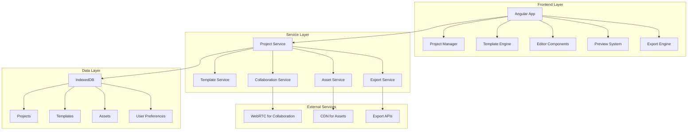

# Design Document

## Overview

The Enhanced Dynamic Builder transforms the existing Angular-based template preview application into a comprehensive website building platform. The design maintains the current component architecture while adding robust data persistence, advanced customization capabilities, real-time collaboration, and professional export functionality.

The system will evolve from a simple template previewer to a full-featured website builder that supports project management, custom template creation, multi-section layouts, and deployment-ready exports.

## Architecture

### High-Level Architecture



### Core Components Architecture

The application will maintain its current component structure while adding new specialized components:

1. **App Component** - Enhanced with project management and global state
2. **Project Manager Component** - New component for project CRUD operations
3. **Template Builder Component** - New component for custom template creation
4. **Section Manager Component** - Enhanced component for multi-section management
5. **Advanced Editor Component** - Enhanced styling and customization tools
6. **Collaboration Panel Component** - New component for real-time collaboration
7. **Export Wizard Component** - New component for multi-format exports
8. **Asset Manager Component** - New component for media management

## Components and Interfaces

### Core Interfaces

```typescript
// Enhanced Project Interface
interface Project {
  id: string;
  name: string;
  description: string;
  createdAt: Date;
  updatedAt: Date;
  sections: Section[];
  globalStyles: GlobalStyles;
  settings: ProjectSettings;
  collaborators?: Collaborator[];
  version: number;
}

// Enhanced Section Interface
interface Section {
  id: string;
  type: SectionType;
  templateId: string;
  content: SectionContent;
  styles: SectionStyles;
  order: number;
  isVisible: boolean;
  responsiveSettings: ResponsiveSettings;
}

// Template Management Interface
interface CustomTemplate {
  id: string;
  name: string;
  description: string;
  type: SectionType;
  html: string;
  css: string;
  variables: TemplateVariable[];
  previewImage: string;
  isCustom: boolean;
  createdBy: string;
  createdAt: Date;
}

// Asset Management Interface
interface Asset {
  id: string;
  name: string;
  type: AssetType;
  url: string;
  size: number;
  dimensions?: { width: number; height: number };
  optimizedVersions?: OptimizedAsset[];
  usageCount: number;
  tags: string[];
  uploadedAt: Date;
}

// Collaboration Interface
interface CollaborationSession {
  projectId: string;
  participants: Participant[];
  changes: Change[];
  comments: Comment[];
  isActive: boolean;
}
```

### Service Interfaces

```typescript
// Enhanced Project Service
interface ProjectService {
  createProject(project: Partial<Project>): Promise<Project>;
  getProjects(): Promise<Project[]>;
  getProject(id: string): Promise<Project>;
  updateProject(id: string, updates: Partial<Project>): Promise<Project>;
  deleteProject(id: string): Promise<void>;
  duplicateProject(id: string): Promise<Project>;
  exportProject(id: string, format: ExportFormat): Promise<ExportResult>;
}

// Template Management Service
interface TemplateService {
  getBuiltInTemplates(): TemplateSection[];
  getCustomTemplates(): CustomTemplate[];
  createCustomTemplate(template: Partial<CustomTemplate>): Promise<CustomTemplate>;
  updateCustomTemplate(id: string, updates: Partial<CustomTemplate>): Promise<CustomTemplate>;
  deleteCustomTemplate(id: string): Promise<void>;
  importTemplate(templateData: any): Promise<CustomTemplate>;
}

// Asset Management Service
interface AssetService {
  uploadAsset(file: File): Promise<Asset>;
  getAssets(): Promise<Asset[]>;
  deleteAsset(id: string): Promise<void>;
  optimizeAsset(id: string): Promise<Asset>;
  searchAssets(query: string): Promise<Asset[]>;
  getAssetUsage(id: string): Promise<AssetUsage[]>;
}
```

## Data Models

### Project Data Model

The project data model extends the current template system to support comprehensive project management:

```typescript
interface ProjectData {
  // Basic project information
  metadata: {
    id: string;
    name: string;
    description: string;
    thumbnail: string;
    createdAt: Date;
    updatedAt: Date;
    version: number;
  };
  
  // Content structure
  content: {
    sections: Section[];
    globalStyles: GlobalStyles;
    customTemplates: CustomTemplate[];
    assets: Asset[];
  };
  
  // Configuration
  settings: {
    responsive: ResponsiveSettings;
    seo: SEOSettings;
    performance: PerformanceSettings;
    integrations: Integration[];
  };
  
  // Collaboration
  collaboration: {
    isShared: boolean;
    collaborators: Collaborator[];
    permissions: Permission[];
    comments: Comment[];
  };
}
```

### Template Data Model

Enhanced template system supporting custom templates and advanced features:

```typescript
interface TemplateDefinition {
  // Template metadata
  id: string;
  name: string;
  description: string;
  category: string;
  type: SectionType;
  isCustom: boolean;
  
  // Template structure
  structure: {
    html: string;
    css: string;
    variables: TemplateVariable[];
    dependencies: string[];
  };
  
  // Configuration
  config: {
    responsive: boolean;
    customizable: string[];
    previewImage: string;
    tags: string[];
  };
  
  // Metadata
  meta: {
    createdBy?: string;
    createdAt: Date;
    updatedAt: Date;
    usageCount: number;
    rating?: number;
  };
}
```

## Error Handling

### Error Categories

1. **Data Persistence Errors**
   - IndexedDB connection failures
   - Storage quota exceeded
   - Data corruption recovery

2. **Template Processing Errors**
   - Invalid HTML/CSS syntax
   - Missing template variables
   - Circular dependencies

3. **Asset Management Errors**
   - File upload failures
   - Unsupported file formats
   - Asset optimization failures

4. **Collaboration Errors**
   - WebRTC connection failures
   - Sync conflicts
   - Permission denied errors

5. **Export Errors**
   - Code generation failures
   - Missing dependencies
   - Format conversion errors

### Error Handling Strategy

```typescript
interface ErrorHandler {
  // Global error handling
  handleGlobalError(error: Error, context: string): void;
  
  // Specific error handlers
  handleDataError(error: DataError): Promise<void>;
  handleTemplateError(error: TemplateError): Promise<void>;
  handleAssetError(error: AssetError): Promise<void>;
  handleCollaborationError(error: CollaborationError): Promise<void>;
  handleExportError(error: ExportError): Promise<void>;
  
  // Recovery mechanisms
  attemptRecovery(error: RecoverableError): Promise<boolean>;
  showUserFriendlyError(error: Error): void;
}
```

## Testing Strategy

### Unit Testing

- **Component Testing**: Test all new and enhanced components with Angular Testing Utilities
- **Service Testing**: Mock external dependencies and test business logic
- **Pipe Testing**: Test custom pipes for data transformation
- **Utility Testing**: Test helper functions and utilities

### Integration Testing

- **Data Flow Testing**: Test data flow between components and services
- **Template Processing**: Test template compilation and rendering
- **Asset Management**: Test file upload, processing, and optimization
- **Export Functionality**: Test various export formats and outputs

### End-to-End Testing

- **User Workflows**: Test complete user journeys from project creation to export
- **Collaboration Features**: Test real-time collaboration scenarios
- **Responsive Design**: Test responsive behavior across different devices
- **Performance**: Test application performance under various loads

### Testing Tools

- **Jasmine/Karma**: Unit and integration testing
- **Cypress**: End-to-end testing
- **Angular Testing Utilities**: Component testing
- **MSW (Mock Service Worker)**: API mocking for testing

## Performance Considerations

### Frontend Performance

1. **Lazy Loading**: Implement lazy loading for components and modules
2. **Virtual Scrolling**: Use virtual scrolling for large lists (projects, templates, assets)
3. **Change Detection**: Optimize Angular change detection with OnPush strategy
4. **Bundle Optimization**: Code splitting and tree shaking for smaller bundles

### Data Management Performance

1. **IndexedDB Optimization**: Efficient indexing and querying strategies
2. **Caching**: Implement intelligent caching for templates and assets
3. **Debouncing**: Debounce user inputs to reduce unnecessary operations
4. **Background Processing**: Use Web Workers for heavy computations

### Asset Optimization

1. **Image Optimization**: Automatic image compression and format conversion
2. **Lazy Loading**: Lazy load images and assets in preview
3. **CDN Integration**: Optional CDN integration for asset delivery
4. **Progressive Loading**: Progressive enhancement for large assets

## Security Considerations

### Data Security

1. **Local Storage**: Secure handling of sensitive data in IndexedDB
2. **Input Sanitization**: Sanitize all user inputs, especially HTML/CSS
3. **XSS Prevention**: Prevent cross-site scripting in custom templates
4. **Content Security Policy**: Implement CSP for additional security

### Collaboration Security

1. **WebRTC Security**: Secure peer-to-peer connections
2. **Permission Management**: Role-based access control for shared projects
3. **Data Validation**: Validate all collaborative changes
4. **Audit Trail**: Maintain audit logs for collaborative actions

### Export Security

1. **Code Sanitization**: Sanitize generated code before export
2. **Dependency Validation**: Validate external dependencies
3. **Safe Defaults**: Use secure defaults in generated code
4. **Vulnerability Scanning**: Optional scanning of generated code

## Scalability Considerations

### Client-Side Scalability

1. **Memory Management**: Efficient memory usage and cleanup
2. **Large Projects**: Handle projects with many sections and assets
3. **Concurrent Operations**: Handle multiple simultaneous operations
4. **Browser Compatibility**: Support for modern browsers with graceful degradation

### Data Scalability

1. **Storage Limits**: Handle IndexedDB storage limitations
2. **Data Pagination**: Paginate large datasets (projects, templates, assets)
3. **Incremental Loading**: Load data incrementally as needed
4. **Cleanup Strategies**: Automatic cleanup of unused data

### Feature Scalability

1. **Plugin Architecture**: Extensible architecture for future features
2. **Template System**: Scalable template management system
3. **Integration Points**: Well-defined integration points for extensions
4. **API Design**: Future-proof API design for potential backend integration